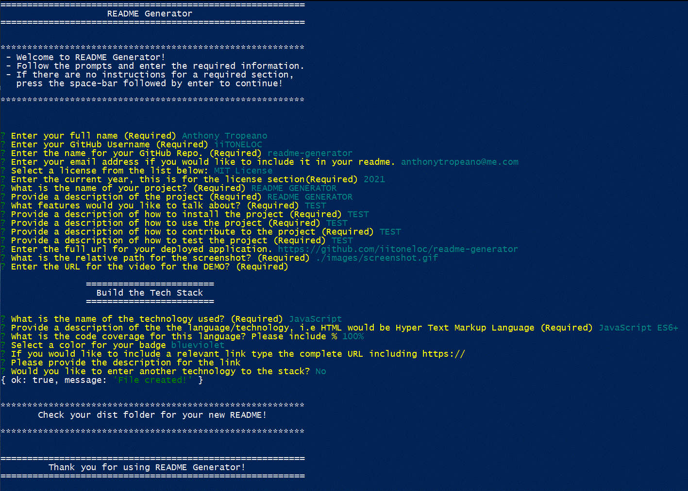

# README Generator  
[](https://opensource.org/licenses/MIT)  

# Screenshot


# Description
README Generator is a professional README generator that can be used for all your projects. It includes all the relevant sections and offers badges for the license, the language count and the top language. The Technology stack features the language and code coverage in the form of badges, a place for a description of the language used, and a place for relevant links. 

# Table of Contents
* [Demo](#demo)  
* [Technology](#technology)  
* [Features](#features)  
* [Installation](#installation)  
* [Usage](#usage)  
* [Contribute](#contribute)  
* [Tests](#tests)  
* [Questions](#questions)  
* [License](#license)

# Demo
[README Generator](https://drive.google.com/file/d/1Ic8hjYK_pXZW9p-LFVZ_kld4bHrclXOC/view)

# Technology 
| Technology | Description                        |Links ↘️ |
| ---------- | -----------------------------------| ------|  
|  | JavaScript ES6+ | [Inquirer](https://www.npmjs.com/package/inquirer) |

# Features
README Generator features the Inquire package.

# Installation  
Project Repository: [readme-generator](https://github.com/iiTONELOC/readme-generator)  
Clone the repo, link is above.  
Navigate to the root of the project in your terminal and type the following command: ```npm install```  
Once the modules have finished loading type the following command to launch the program: ```node index``` 

# Usage

Follow the prompts and enter the required information. If there isn't information to be entered for a required section press the space bar followed by enter to continue. Remember that urls for images are to be relative paths and the image will not display until you place your newly created README into the corresponding directory.

# Contribute 
If you wish to contribute, fork the repo and issue a pull request for changes.

# Tests
Any tests can be performed by running the program.

# Questions
Feel free to reach out if you have any questions

Contact via GitHub: [iiTONELOC](https://github.com/iiTONELOC)  
Send an email: [](mailto:anthonytropeano@me.com)

# License
MIT License

        Copyright (c) 2021 Anthony Tropeano
        
        Permission is hereby granted, free of charge, to any person obtaining a copy
        of this software and associated documentation files (the "Software"), to deal
        in the Software without restriction, including without limitation the rights
        to use, copy, modify, merge, publish, distribute, sublicense, and/or sell
        copies of the Software, and to permit persons to whom the Software is
        furnished to do so, subject to the following conditions:
        
        The above copyright notice and this permission notice shall be included in all
        copies or substantial portions of the Software.
        
        THE SOFTWARE IS PROVIDED "AS IS", WITHOUT WARRANTY OF ANY KIND, EXPRESS OR
        IMPLIED, INCLUDING BUT NOT LIMITED TO THE WARRANTIES OF MERCHANTABILITY,
        FITNESS FOR A PARTICULAR PURPOSE AND NONINFRINGEMENT. IN NO EVENT SHALL THE
        AUTHORS OR COPYRIGHT HOLDERS BE LIABLE FOR ANY CLAIM, DAMAGES OR OTHER
        LIABILITY, WHETHER IN AN ACTION OF CONTRACT, TORT OR OTHERWISE, ARISING FROM,
        OUT OF OR IN CONNECTION WITH THE SOFTWARE OR THE USE OR OTHER DEALINGS IN THE
        SOFTWARE.
        
